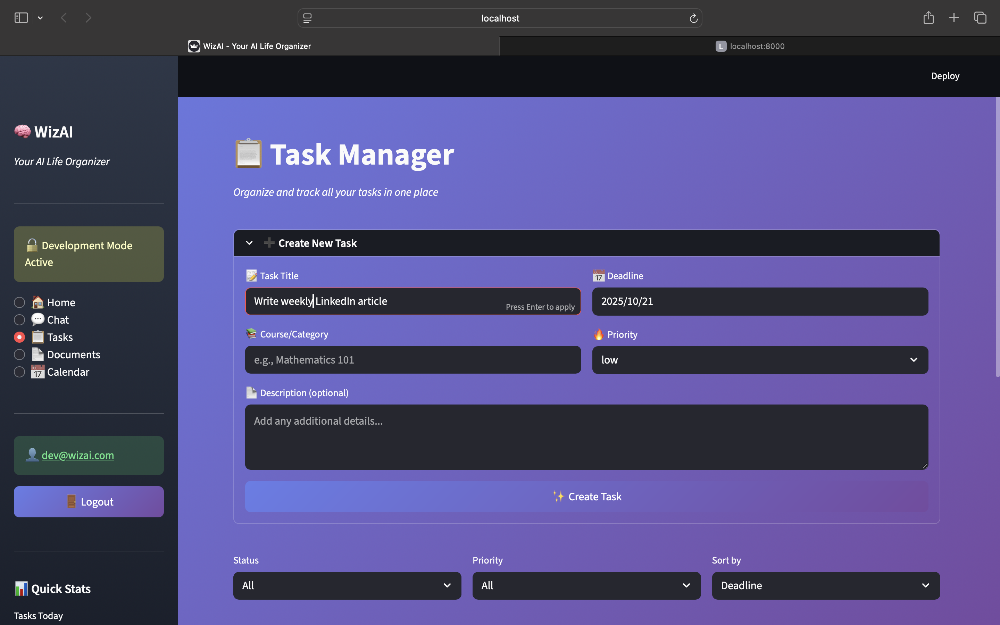
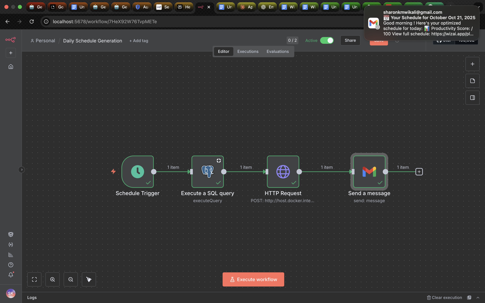
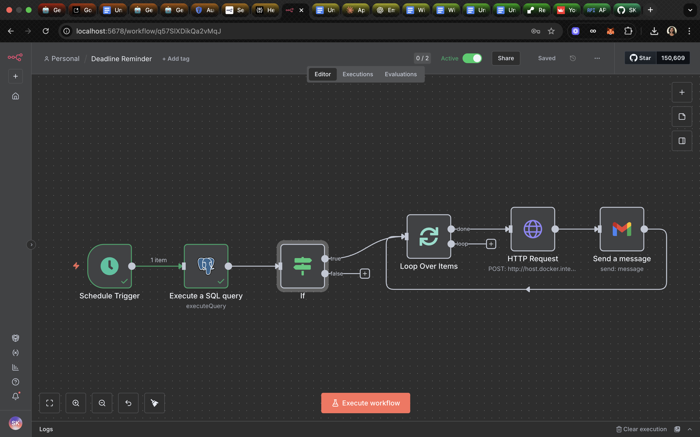

# 🧠 WizAI: Intelligent Academic Assistant

> **WizAI** is an intelligent backend system that goes beyond ChatGPT — designed to help students *organize, plan, and automate* their academic life through intelligent agents and seamless integrations.

---

## Project Overview

### Vision
WizAI is an intelligent backend system that goes beyond ChatGPT by actively organizing student life through:

- **📚 Portal Integration** — Auto-fetches assignments and deadlines from school portals  
- **🧾 Document Intelligence** — Extracts info from screenshots/PDFs to build actionable plans  
- **📅 Calendar Sync** — Bi-directional Google Calendar integration for seamless scheduling  
- **💬 Conversational Planning** — Natural language interface to view, edit, and manage schedules  
- **🤖 Multi-Agent Orchestration** — Specialized agents for planning, extraction, and assistance  
- **⚡ Proactive Automation** — Context-aware suggestions and intelligent workflow triggers  

---

## 💡 Problem Statement
Students struggle with fragmented information across multiple platforms (school portals, email, calendar, and documents).  
Manual organization is **time-consuming** and **error-prone**.  

**WizAI** solves this by creating an intelligent backend that automatically aggregates, processes, and organizes academic life through **AI-powered agents and automation**.  

---
## 🚀 Live Demo
- **Hosted on Streamlit Cloud**: https://wizai-version1.streamlit.app/

---

## 📸 Screenshots & Workflows

### 🖥️ Application Screens

<p align="center">
  
  <br/>
  <em>WizAI Home — Dashboard Overview</em>
</p>

<p align="center">
  
  <br/>
  <em>Task Manager</em>
</p>

---

### ⚙️ n8n Workflows
<p align="center">
  
  <br/>
  <em>n8n Workflow 1 - Daily schedule generation </em>
</p>

<p align="center">
  
  <br/>
  <em>n8n Workflow 2 — Deadline reminders</em>
</p>

<p align="center">
  
  <br/>
  <em>n8n Workflow 3 — New task notifications</em>
</p>

## 🏗️ Tech Stack

| Layer | Tools / Libraries |
|-------|-------------------|
| **Backend Framework** | [FastAPI](https://fastapi.tiangolo.com/) |
| **Database** | PostgreSQL + SQLAlchemy ORM |
| **Authentication** | JWT + OAuth2 (via `python-jose`, `passlib`) |
| **AI Integration** | OpenAI API, LangChain (planned) |
| **Environment Management** | Pydantic Settings + `.env` |
| **Logging** | Loguru |
| **Deployment (planned)** | Docker + Render / Railway / AWS |

---

## 📂 Project Structure
```python 
wizai/
├── backend/                  # FastAPI backend
│   ├── app/                  # Core application (routes, models, config, database)
│   ├── tests/                # Unit and integration tests
│   ├── logs/                 # Application logs
│   └── chroma_db/            # Vector database or embeddings storage

├── frontend/                 # Frontend application (e.g., React or Streamlit UI)

├── workflows/                # Automation and orchestration workflows
│   └── n8n_workflows/        # n8n workflow definitions

├── n8n_data/                 # n8n runtime and configuration data
│   ├── binaryData/           # Stored files used in workflows
│   ├── nodes/                # Custom or community nodes
│   ├── ssh/                  # SSH keys and credentials
│   ├── git/                  # Git integration metadata

├── docs/                     # Documentation and guides

├── assets/                   # Images, screenshots, and static files for README or docs

├── venv/                     # Python virtual environment
│   ├── bin/
│   ├── include/
│   ├── lib/
│   └── share/

├── .git/                     # Git version control metadata
│   ├── hooks/
│   ├── logs/
│   ├── objects/
│   ├── refs/
│   └── info/

├── .env                      # Local environment variables (excluded from git)
└── .env.example              # Template for environment variables (shared safely)
```

---

### ⚙️ Setup Instructions

### 1. Clone the Repository
```bash
git clone https://github.com/<your-username>/Wiz-ai.git
cd Wiz-ai
```
### 2. Create and Activate Virtual Environment
```bash
python3 -m venv venv
source venv/bin/activate
```

### 3. Install Dependencies
```bash
pip install -r requirements.txt
```

### 4. Running the Application

### Start Backend:
```bash
cd backend
source ../venv/bin/activate
uvicorn app.main:app --reload --host 0.0.0.0 --port 8000
```

### Start Frontend (in separate terminal):
```bash
cd wiz-ai
source venv/bin/activate
streamlit run frontend/streamlit_app.py
```

### Access the Application:
- Frontend: http://localhost:8501
- Backend API: http://localhost:8000
- API Docs: http://localhost:8000/docs

## 📝 Future Enhancements
- Document OCR for automatic task extraction
- Google Calendar integration
- n8n workflow automation

## 🧍‍♀️ Author

**Sharon Kitavi**  
*Data Scientist · Community & Innovation Leader · Cofounder — Building Creative Solutions*

[](https://www.linkedin.com/in/sharonkitavi)  

---

## 🪄 License

This project is licensed under the [MIT License](LICENSE).

---

> *“Intelligence is not just answering questions — it’s anticipating needs.”* ✨
